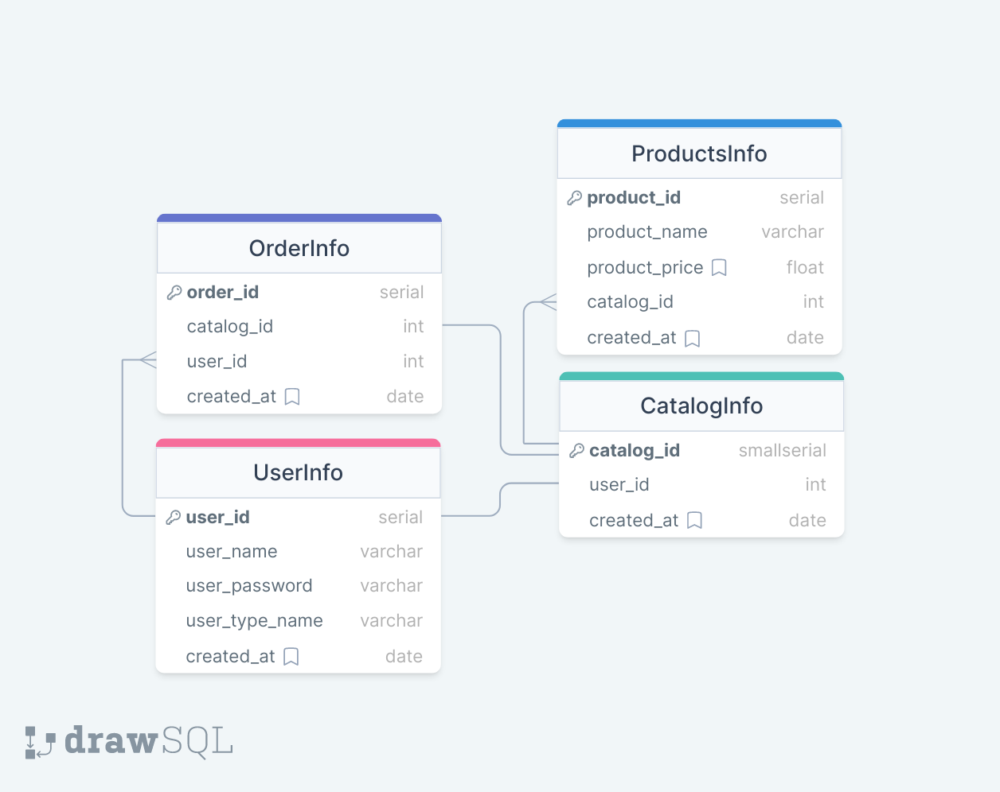

# Buyer Seller API

1. [Introduction](#introduction)
    - [Database Schema](#database-schema)
2. [Installation](#installation)
	- [Clone Repository](#1-clone-the-repository)
	- [Installing dependencies](#2-install-dependencies)
	- [Sample Environment Variables](#3-sample-environment-variables)
3. [Auth APIs](#auth-apis)
    - [Register User](#1-register-user)
    - [Login User](#2-login-user)
4. [APIs for Buyers](#apis-for-buyers)
    - [Get List of Sellers](#1-get-list-of-sellers)
    - [Get Seller's Catalog](#2-get-sellers-catalog)
    - [Create Order](#3-create-order)
5. [APIs for Sellers](#apis-for-sellers)
    - [Create Catalog](#1-create-catalog)
    - [Get Orders](#2-get-orders)
6. [Contributing](#contributing)


## Introduction
A simple Nodejs api to demonstrate simple Buyer Seller operations in an E-Commerce application.

- The database used for the project is PostgreSQL.
Here's the database schema


There are 4 Tables

1. UserInfo
2. CatalogInfo
3. ProductsInfo
4. OrderInfo

```sql
CREATE TYPE userType AS ENUM (
    'buyer',
    'seller'
);

-- UserInfo
CREATE TABLE UserInfo(
	user_id SERIAL PRIMARY KEY,
	user_name VARCHAR NOT NULL UNIQUE,
	user_password VARCHAR NOT NULL,
	user_type_name userType NOT NULL,
	created_at DATE DEFAULT NOW()
)

-- CatalogInfo
CREATE TABLE CatalogInfo(
	catalog_id SMALLSERIAL PRIMARY KEY,
	user_id INT NOT NULL UNIQUE,
	created_at DATE DEFAULT NOW(),
	FOREIGN KEY (user_id) REFERENCES UserInfo(user_id)
)

-- ProductsInfo
CREATE TABLE ProductsInfo(
	product_id SERIAL PRIMARY KEY,
	product_name VARCHAR NOT NULL,
	product_price NUMERIC(5,2) NOT NULL,
	catalog_id INT NOT NULL,
	created_at TIMESTAMP DEFAULT NOW(),
	FOREIGN KEY (catalog_id) REFERENCES CatalogInfo(catalog_id)
)

-- OrderInfo
CREATE TABLE OrderInfo(
	order_id SERIAL PRIMARY KEY,
	catalog_id INT NOT NULL,
	user_id INT NOT NULL,
	created_at TIMESTAMP DEFAULT NOW(),
	FOREIGN KEY (catalog_id) REFERENCES CatalogInfo(catalog_id),
	FOREIGN KEY (user_id) REFERENCES UserInfo(user_id)
)
```
---
## Installation

#### 1. Clone the repository

```bash
git clone https://github.com/yourusername/buyer-seller-api.git
cd buyer-seller-api
```

#### 2. Install dependencies
```bash
npm install
```

#### 3. Sample Environment Variables

```
PORT=3000
DB_HOST=your_postgres_host
DB_PORT=5432
DB_USER=your_postgres_user
DB_PASSWORD=your_postgres_password
DB_DATABASE=your_postgres_database
ACCESS_TOKEN_SECRET=your_access_token_secret
REFRESH_TOKEN_SECRET=your_refresh_token_secret
```

---

## Auth APIs

### 1. Register User

- This endpoint is for registering a new user

**Endpoint:**

```
POST /api/auth/register
```

**Payload:**

```json
{
  "userName": "john123",
  "userPassword": "pass@123",
  "userType": "buyer/seller"
}
```

### 2. Login User

- This endpoint is for loggin an existing user

**Endpoint:**

```
POST /api/auth/login
```

**Payload:**

```json
{
  "userName": "john123",
  "userPassword": "pass@123"
}
```

**Response**

```json
{
  "success": true,
  "token": "YOUR_JWT_TOKEN"
}
```

---

## APIs for Buyers

### 1. Get List of Sellers

**Endpoint:**

```
GET /api/buyer/list-of-sellers
```

**Response**

```json
{
  "status": 200,
  "success": true,
  "count": 2,
  "data": [
    {
      "seller_id": 2,
      "seller_name": "om05"
    },
    {
      "seller_id": 4,
      "seller_name": "muskan07"
    }
  ]
}
```

### 2. Get Seller's Catalog

**Endpoint:**

```
GET /api/buyer/seller-catalog/:seller_id
```

**Response**

```json
{
  "status": 200,
  "success": true,
  "data": {
    "count": 2,
    "seller_id": 2,
    "seller_name": "om05",
    "products": [
      {
        "product_id": 1,
        "product_name": "Mobile",
        "product_price": "299.00"
      },
      {
        "product_id": 2,
        "product_name": "Smart Watch",
        "product_price": "99.00"
      }
    ]
  }
}
```

**Parameters:**

- `seller_id` (integer): ID of the seller whose catalog you want to retrieve.

### 3. Create Order

**Endpoint:**

```
POST /api/buyer/create-order/:seller_id
```

**Parameters:**

- `seller_id` (integer): ID of the seller you want to create an order with.

**Response**

```json
{
  "status": 200,
  "success": true,
  "message": "Order Successful"
}
```
---
## APIs for Sellers

### 1. Create Catalog

**Endpoint:**

```
POST /api/seller/create-catalog
```

**Payload:**

```json
{
  "products": [
    {
      "name": "Mobile",
      "price": 299
    },
    {
      "name": "Smart Watch",
      "price": 99
    }
  ]
}
```

**Response**

```json
{
  "status": 201,
  "success": true,
  "message": "Catalog created succesfully"
}
```

### 2. Get Orders
- This retrieves the list of orders received by a seller.
**Endpoint:**

```
GET /api/seller/orders
```

**Response**

```json
{
  "status": 200,
  "success": true,
  "totalOrders": 1,
  "orders": [
    {
      "order_id": 2,
      "buyer_id": 1,
      "buyer_name": "lovely08",
      "products": [
        {
          "product_name": "Mobile",
          "product_price": "299.00"
        },
        {
          "product_name": "Smart Watch",
          "product_price": "99.00"
        }
      ],
      "order_time": "11:22:07 am"
    }
  ]
}
```

Feel free to create PR for improvements❤️
